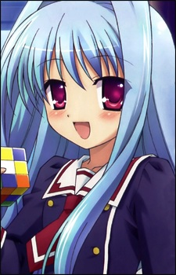
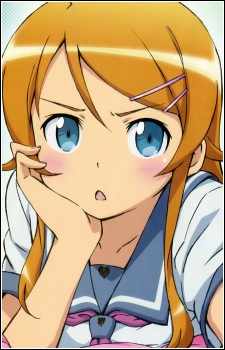
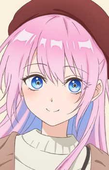
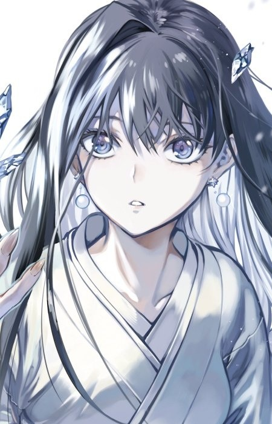
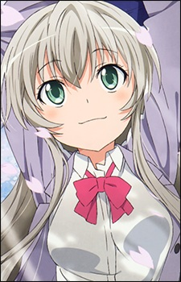

<h2>Hi, I am a certified garbage programmer, but I sure ain't a vibe coder! 👋</h2>

<b><ins>What I'm good at</ins>:</b> I'll get back to ya on that

<b><ins>What I'm bad at</ins>:</b> everything

<h3>Favorite anime characters (Work in Progress)</h3>
<table>
  <tr>
    <td width="12.5%" align="center"> 
      
        <b>Fear Kubrick</b> 
        C3 (2011)
      
    </td>
    <td width="12.5%" align="center"> 
      
        <b>Kirino Kousaka</b> 
        Oreimo (2010)
      
    </td>
    <td width="12.5%" align="center"> 
      
        <b>Shikimori</b> 
        Kawaii dake ja Nai Shikimori-san (2022)
      
    </td>
    <td width="12.5%" align="center"> 
      
        <b>Chiya</b> 
        Urara Meirochou (2017)
      
    </td>
    <td width="12.5%" align="center"> 
      
        <b>Line 1 Text</b> 
        Line 2 Text
      
    </td>
    <td width="12.5%" align="center"> 
      
        <b>Line 1 Text</b> 
        Line 2 Text
      
    </td>
    <td width="12.5%" align="center"> 
      
        <b>Yuki-Onna</b> 
        Kyokou Suiri (2023)
      
    </td>
    <td width="12.5%" align="center"> 
      
        <b>Nyaruko</b> 
        Haiyore! Nyaruko-san (2012)
      
    </td>
  </tr>
</table>

<h3 align="center">Favorite Honkai: Star Rail Characters</h3>

<table>
  <tr>
    <td width="25%" align="center">
      <a href="https://honkai-star-rail.fandom.com/wiki/Evanescia">
         
      </a>
      
        <b>Evanescia</b> 
        Path of Elation
      
    </td>
    <td width="25%" align="center">
      <a href="https://honkai-star-rail.fandom.com/wiki/Firefly">
         
      </a>
      
        <b>Firefly</b> 
        Path of Destruction
      
    </td>
    <td width="25%" align="center">
      <a href="https://honkai-star-rail.fandom.com/wiki/The_Herta">
         
      </a>
      
        <b>Madam Herta</b> 
        Path of Erudition
      
    </td>
    <td width="25%" align="center">
      <a href="https://honkai-star-rail.fandom.com/wiki/Lingsha">
         
      </a>
      
        <b>Lingsha</b> 
        Path of Abundance
      
    </td>
  </tr>
  <tr>
    <td width="25%" align="center">
      <a href="https://honkai-star-rail.fandom.com/wiki/Hysilens">
         
      </a>
      
        <b>Hysilens</b> 
        Path of Nihility
      
    </td>
    <td width="25%" align="center">
      <a href="https://honkai-star-rail.fandom.com/wiki/Seele">
         
      </a>
      
        <b>Seele</b> 
        Path of Hunt
      
    </td>
    <td width="25%" align="center">
      <a href="https://honkai-star-rail.fandom.com/wiki/Guinaifen">
         
      </a>
      
        <b>Guinaifen</b> 
        Path of Nihility
      
    </td>
    <td width="25%" align="center">
      <a href="https://honkai-star-rail.fandom.com/wiki/March_7th/The_Hunt">
         
      </a>
      
        <b>March 7th • The Hunt</b> 
        Path of Nihility
      
    </td>
  </tr>
</table>

<h3 align="center">Favorite Honkai: Star Rail Light Cone Art</h3>

<table>
  <tr>
    <td width="33.33%" align="center">
      <a href="https://honkai-star-rail.fandom.com/wiki/We_Are_Wildfire">
         
      </a>
      
        <b>We Are Wildfire</b> 
        She got used to people losing their homes. 
        And she got used to people losing their lives. 
        But crying alone was useless.
      
    </td>
    <td width="33.33%" align="center">
      <a href="https://honkai-star-rail.fandom.com/wiki/Whereabouts_Should_Dreams_Rest">
         
      </a>
      
        <b>Whereabouts Should Dreams Rest</b> 
        In the deathly silence, like flames dissolving in the sea, 
        she is reduced to a singular spot of fire and 
        unendingly progresses towards the light...
      
    </td>
    <td width="33.33%" align="center">
      <a href="https://honkai-star-rail.fandom.com/wiki/Something_Irreplaceable">
         
      </a>
      
        <b>Something Irreplaceable</b> 
        "Do you have something that's irreplaceable, Svarog?" 
        "..." 
        "You'll definitely find it one day, Svarog."
      
    </td>
  </tr>
  <tr>
    <td width="33.33%" align="center">
      <a href="https://honkai-star-rail.fandom.com/wiki/Under_the_Blue_Sky">
         
      </a>
      
        <b>Under the Blue Sky</b> 
        ... 
        That was when they were still the same height. 
        That was when they shared the same smile. 
      
    </td>
    <td width="33.33%" align="center">
      <a href="https://honkai-star-rail.fandom.com/wiki/Planetary_Rendezvous">
         
      </a>
      
        <b>Planetary Rendezvous</b> 
        ... 
        All she knew was that she could at long last be rid of 
        the judgmental eyes and petty bickering of her family.
      
    </td>
    <td width="33.33%" align="center">
      <a href="https://honkai-star-rail.fandom.com/wiki/Dance_at_Sunset">
         
      </a>
      
        <b>Dance at Sunset</b> 
        Amidst a rising galaxy of stars, her unguarded smile 
        dissolves into a bloom of innocence, akin to the 
        layered twilight hues adrift in the sky.
      
    </td>
  </tr>
</table>

<!--
**NikolitePro/NikolitePro** is a ✨ _special_ ✨ repository because its `README.md` (this file) appears on your GitHub profile.

Here are some ideas to get you started:

- 🔭 I’m currently working on ...
- 🌱 I’m currently learning ...
- 👯 I’m looking to collaborate on ...
- 🤔 I’m looking for help with ...
- 💬 Ask me about ...
- 📫 How to reach me: ...
- 😄 Pronouns: ...
- ⚡ Fun fact: ...
-->
